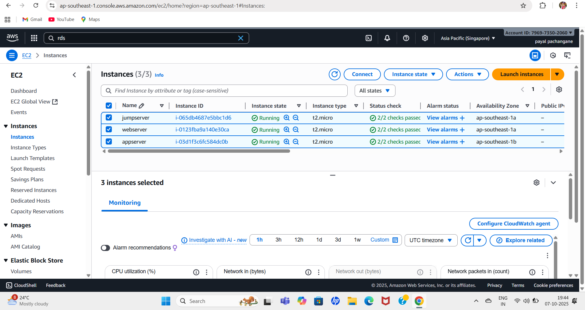

## 3-Tier Architecture Project

###This project demonstrates a *3-tier web application architecture*.  
###The three layers are: *Web Layer*, *Application Layer*, and *Database Layer*.

---

## 1️⃣ Web Layer (Presentation Tier)

**Purpose:** Handles user requests from the browser and displays web pages.

**Setup Steps:**
1. Launch an **EC2 instance** in the **Public Subnet**.
2. Configure **Security Group**: Allow **HTTP(80), HTTPS(443), SSH(22)**.
3. Install **Apache/Nginx** web server.
4. Deploy **HTML/PHP** web pages.

**Screenshot:**

---

## 2️⃣ Application Layer (Business Logic Tier)

**Purpose:** Receives requests from the Web Layer, processes them, and interacts with the Database Layer.

**Setup Steps:**
1. Launch an **EC2 instance** in the **Private Subnet**.
2. Configure **Security Group**: Allow **HTTP traffic from Web Layer only**.
3. Deploy **backend code / APIs**.
4. Configure **database connection**.

**Screenshot:**

---

## 3️⃣ Database Layer (Data Tier)

**Purpose:** Stores and retrieves data for the Application Layer.

**Setup Steps:**
1. Create an **RDS instance** in the **Private Subnet**.
2. Configure **Security Group**: Allow **MySQL(3306) traffic from Application Layer only**.
3. Create **databases, tables, and users**.
4. Test **connectivity from Application Layer**.

**Screenshot:**

---

## Project Architecture Diagram

*Diagram showing Web → App → DB communication and subnet layout.*

---

## Technologies Used

- **AWS:** EC2, VPC, Subnets, Security Groups, RDS  
- **Web:** Apache/Nginx, HTML, PHP  
- **Database:** MySQL / PostgreSQL  

---

## Outcome

- Secure and scalable **3-layer architecture**.  
- Layer-wise isolation of **Web, Application, and Database tiers**.  
- Easy to deploy for **learning and testing**.  

